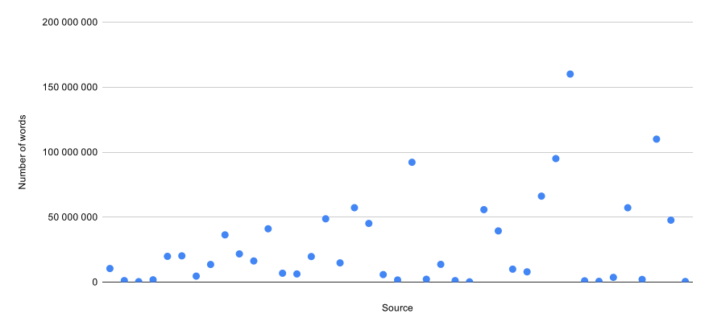

# PolNewsModels

Polish News Model Project

# Goals

| No | Goal                                                  | Progress |
|---:|-------------------------------------------------------|---------:|
| 1  | Collect 20 GB of high-quality texts from news portals |  8/20 GB |
| 2  | Train BERT/RoBERTa model                              |       - |
| 3  | Train NER on KPWr and NKJP models                     |       - |

# Current distribution of texts

